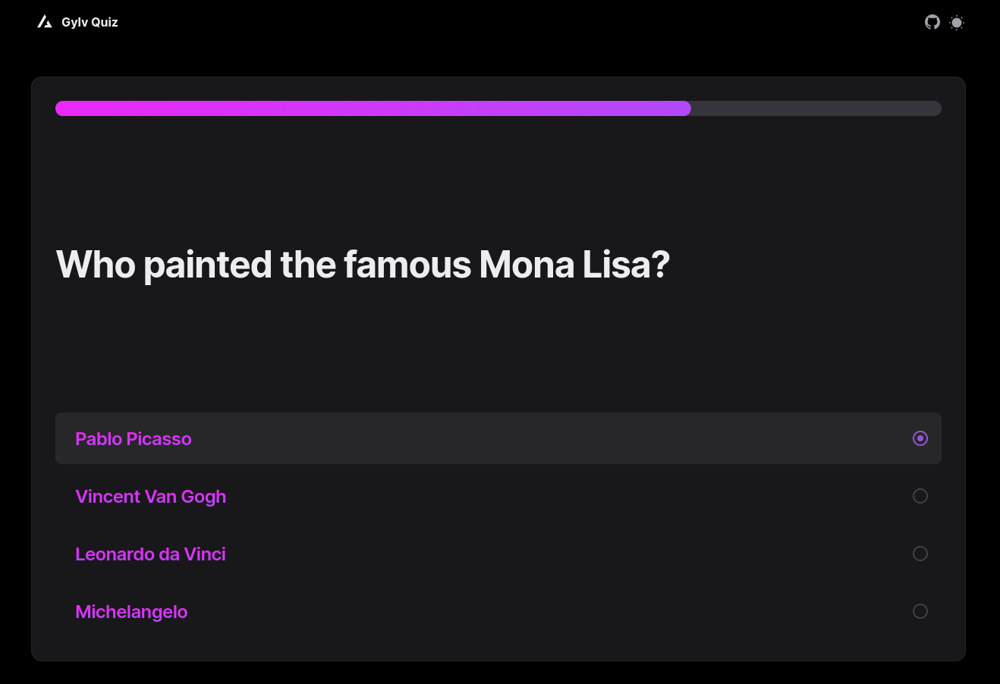

<center>
  
</center>

# Project Description

A multiplayer quiz game web app with AI generated questions and answers.

# Project Setup

Before launching the server, in the server folder, create and fill up a .env file following the .env.example file as example in that folder.

To launch the server (default port is 3001) :

```bash
cd server/
npm install
npm start
```

To launch the client (default port is 3000) :

```bash
cd client
npm install
npm run build
npm start
```
